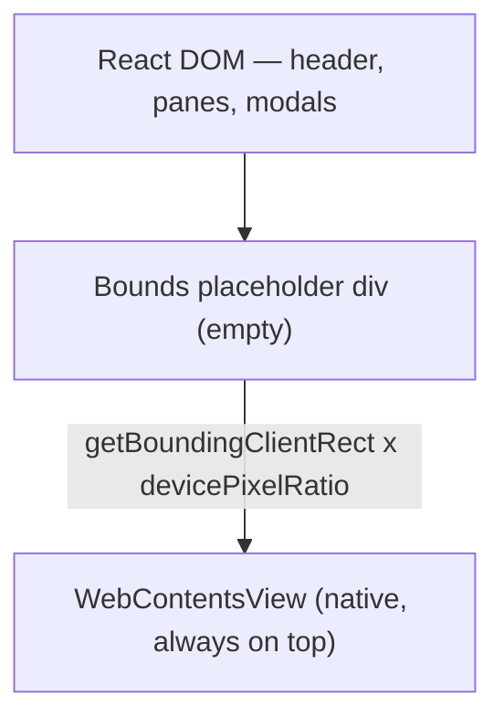

# Git-Mastery — components & layout patterns

Component recipes and screen composition patterns. Pair with [`tokens-and-surfaces.md`](tokens-and-surfaces.md).

---

## 1. Page kit primitives

Build screens from these composable pieces:

| Primitive                        | Role                                                 |
| -------------------------------- | ---------------------------------------------------- |
| `AppHeader`                      | Fixed 64px bar — site nav left, settings right       |
| `Card`                           | Solid opaque panel with border (and optional shadow) |
| `SectionTitle`                   | Serif group header with hairline underline           |
| `ListRow`                        | Dense catalog / result row with trailing action      |
| `StatusPill`                     | Exercise or task state                               |
| `Field` + `TextInput` / `Select` | Form controls with uppercase micro-labels            |
| `SearchInput`                    | Leading icon, grows to fill the toolbar              |
| `TabFilter`                      | Underlined tabs with counts                          |
| `MenuDropdown`                   | Icon trigger + labelled item list                    |
| `Modal`                          | Solid dialog over a dim overlay                      |
| `Toast`                          | Top-right ephemeral feedback                         |
| `Stepper`                        | Short progress rail for first-run flows              |
| `ChecklistRow`                   | Status icon + label + detail + inline actions        |
| `EmptyState`                     | Centered muted icon + title + hint                   |
| `LoadingState` / `ErrorState`    | Centered spinner or failure copy                     |
| `ResizeHandle`                   | 6px col-resize strip on a pane edge                  |
| `TerminalPane`                   | Black full-bleed xterm surface                       |
| `NativeViewSlot`                 | Empty bounds placeholder for the native web view     |

---

## 2. Component recipes

### AppHeader

```text
h-16 bg-surface border-b border-border px-4
left:  Lessons / Exercises / Progress (text-base bold; active is accent, no underline)
right: settings icon button
overflow-visible so dropdowns escape the bar
```

The header is chrome, not a page title bar — view titles live inside the content pane. The lessons panel toggle is not in the header; it sits in a slim bar above the native view (closed) or in the panel header (open), and only on Lessons URLs.

### Card

```tsx
{
  /* elevated panel — onboarding, modal body */
}
<div className="rounded-2xl border border-border bg-surface p-6" />;

{
  /* full-bleed content pane */
}
<div className="h-full w-full overflow-y-auto bg-surface" />;
```

Add `shadow-card` only when the panel floats above other content (modal, dropdown).

### Buttons

| Kind               | Style                                                                                             |
| ------------------ | ------------------------------------------------------------------------------------------------- |
| **Primary**        | `bg-brand-600 text-white hover:bg-brand-700 rounded-md px-3 py-1.5 text-sm font-medium shadow-sm` |
| **Outline**        | `border border-brand-600 text-accent hover:bg-accent-soft rounded-md` — e.g. Continue vs Download |
| **Secondary**      | `bg-surface border border-border text-fg hover:bg-hover rounded-md`                               |
| **Danger solid**   | `bg-danger-solid text-white hover:bg-danger-solid-hover`                                          |
| **Danger outline** | `border border-danger-border text-danger hover:bg-danger-soft`                                    |
| **Ghost icon**     | transparent, `text-muted`, hover `bg-hover`, `rounded-full`                                       |
| **Soft icon**      | `bg-accent-soft text-accent hover:bg-accent-soft-hover`, `rounded-md` — inline fix-it actions     |

**One solid primary per action cluster.** Disabled: `opacity-50 pointer-events-none`. Busy: swap the leading icon for a spinner and keep the label so the button does not resize.

### Inputs

```text
height 36–40px; px-3 py-2; text-sm;
bg-surface; border-border; rounded-xl;
placeholder text-faint;
focus: border-brand-400 + ring-2 ring-focus-ring;
```

Field labels: `text-[11.5px] font-medium uppercase tracking-[0.06em] text-muted`.

Wrap fields in a `div`, not a `<label>` spanning the whole control — prevents accidental focus when clicking label whitespace.

### SearchInput

```tsx
<div className="relative min-w-[240px] flex-1">
  <IconSearch
    size={16}
    className="absolute top-1/2 left-3 -translate-y-1/2 text-faint"
  />
  <input className="h-9 w-full rounded-xl border border-border bg-surface pr-3 pl-9 text-sm placeholder:text-faint focus:border-brand-400 focus:ring-2 focus:ring-focus-ring focus:outline-none" />
</div>
```

### TabFilter

```text
row:      flex gap-1 border-b border-border
tab:      px-3 py-2 text-sm text-muted hover:text-fg
active:   text-accent font-medium, 2px brand-600 bottom border (-1px to sit on the row border)
count:    same size, text-faint — "All (42)"
```

### StatusPill

```tsx
<span className="inline-flex items-center rounded border border-accent-border bg-accent-soft px-2 py-0.5 text-[11px] font-medium whitespace-nowrap text-accent" />
```

Always include visible text plus `aria-label` or `title`. See the status table in [`tokens-and-surfaces.md`](tokens-and-surfaces.md) § Color.

### ListRow

The catalog workhorse: a clickable title block plus one trailing action.

```text
row:      flex items-center justify-between gap-4 py-3 border-b border-border
title:    text-accent font-semibold ~16px, hover:underline, truncate
meta:     13px text-muted — lesson · detour · status · active
active:   bg-accent-soft, bleed 8px into the gutters via -mx-2 px-2
action:   small primary (Download) or outline (Continue) button
```

The whole title block is a button; the trailing button repeats the same action so the affordance is obvious.

### SectionTitle

```text
serif 1.45rem semibold text-fg
pb-2 border-b border-border mb-1.5
optional right-side actions on the same row
```

### MenuDropdown

```text
trigger:  ghost icon button, rounded-full, aria-label required
panel:    w-56 rounded-xl border border-border bg-surface p-1 shadow-card
label:    11px uppercase tracking-wide text-faint px-2 py-1.5
item:     flex gap-2 items-center rounded-lg px-2 py-1.5 text-sm hover:bg-hover
icon:     14px text-muted
```

Close on outside click and `Escape`; return focus to the trigger.

### Modal

```text
overlay:  fixed inset-0 bg-overlay
panel:    bg-surface rounded-2xl border border-border shadow-card
sizes:    sm max-w-md · md max-w-2xl · lg max-w-4xl
header:   serif 1.2rem title + ghost close (X icon)
Escape closes the topmost modal only (stack-aware)
```

Two rules specific to this app:

- Render modals inside the provider tree they read context from, not from a detached portal root that sits outside those providers.
- Open and close instantly (no transition) whenever the modal covers the native view — see § Native view constraints.

### Toast

```text
fixed top-right stack
surface card + shadow-card, rounded-xl, max-w-sm
left semantic accent (brand green success / danger / warning / info)
icon + 13px message, optional 13px title above it
auto-dismiss ~4s; errors ~8s
```

### Stepper (first-run rail)

```text
narrow (about half the card width), centered
step:     28–30px circle, 13px label beneath
done:     bg-brand-600 text-white with a check icon
current:  border-2 border-brand-600 text-accent
upcoming: border border-border text-faint, not clickable
connector: 1px border, brand-600 once passed
```

### ChecklistRow

```text
row:      flex items-center justify-between gap-3 py-3, divider between rows
icon:     20px — spinner (checking) / brand-600 check / red x
label:    14px medium
detail:   13px text-muted, break-all for filesystem paths
actions:  soft icon button (install) + ghost icon buttons (open link, re-check)
```

Each row owns its own spinner, result, and retry — a checklist never reports through toasts.

### Empty / loading / error states

```text
empty:    py-20 centered · 24px icon in a 56px rounded-2xl subtle tile ·
          14px medium title · 12.5px text-faint hint (max-w-md)
loading:  centered spinner (brand-600) + 13px muted line
error:    centered 13px text in danger + a retry button when retry is possible
```

Empty and error must read differently — "nothing matches your search" is not "the catalog failed to load".

---

## 3. Layout patterns

### Desktop shell

```text
┌─────────────────────────────────────────────────────────────────┐
│ header 64px — Lessons  Exercises  Progress             settings │
├──────────────┬───────────────────────────┬──────────────────────┤
│ side panel   │ toggle bar (lessons only) │ terminal aside       │
│ 300px        │ + native view             │ resizable, 512px     │
│ lessons only │                           │ min 280px            │
│              │                           │ ◀ resize handle      │
└──────────────┴───────────────────────────┴──────────────────────┘
```

- `html, body, #root { height: 100% }`; the shell is `h-dvh overflow-hidden`. Nothing scrolls at window level.
- Every flex child that can hold long content needs `min-h-0 min-w-0`, otherwise it refuses to shrink and pushes the terminal off screen.
- The main pane is a positioning context: the native view placeholder fills it, and any DOM view sits in an `absolute inset-0` layer above it with a solid `bg-surface` background.

### ResizeHandle

```text
absolute, full height, 6px wide, cursor-col-resize, z-100
on the inner edge of the pane it resizes
```

Drag writes the new width straight to CSS variables on `documentElement` inside `requestAnimationFrame`, then commits to React state on mouseup. Clamp against a `max` evaluated at drag start so a window resize cannot leave a stale bound. Do not re-render per mousemove — the native view resize would lag visibly behind the cursor.

### Native view constraints

The embedded site is an Electron `WebContentsView`: a native layer that paints **above the entire React DOM**. This is the single biggest constraint on the design.



Rules:

1. **Never** place DOM content over the view's bounds and expect it to show — overlays and `z-index` lose against the native layer.
2. Anything that must appear above it (modal, dropdown that overhangs the pane, onboarding) has to claim a suppression for as long as it is mounted, via the `useEmbeddedSuppressed` hook.
3. The placeholder div stays empty apart from a loading state, and its bounds are pushed to the main process in CSS pixels multiplied by `devicePixelRatio`, re-sent on both resize and DPR change.
4. Show and hide with **zero transition duration**. The native layer cannot fade with the DOM, so any animation reads as a flicker.
5. Rounded corners and shadows stop at the pane edge — the view has square corners and cannot be clipped by CSS.

### First-run / setup flow

```text
canvas, h-screen, centered
card: w-[680px] max-w-[92vw] bg-surface rounded-2xl border border-border p-8
  logo 48px + serif welcome title
  centered Stepper (about half width)
  active step panel
  right-aligned primary button; tooltip explains a disabled one
```

The same panels are reachable later from the settings menu, so each one must stand alone inside a modal as well as inside this card.

### Settings modal flow

Icon trigger in the header → menu of labelled panels → one modal whose title comes from the selected panel. Keep panel titles in a single map so the menu item and the modal header cannot drift apart.

---

## 4. Lists & density

- Default row height: comfortable for 13–14px text; avoid oversized 48px+ rows.
- Monospace + `truncate` for paths and identifiers; full value in a `title` tooltip or a copy button.
- Row actions: one compact button or ghost icon buttons — never a stack of full-size primaries per row.
- Group long lists under section titles rather than paginating.

---

## 5. Icons

- Library: `@tabler/icons-react`.
- Toolbar / inline: 14–16px, `text-muted`, hover `text-fg`.
- Status icons: 20px, semantic color.
- Empty state hero: 24px inside a 56px tile.
- Every icon-only control needs an `aria-label`.

---

## 6. Implementation checklist

Copy and verify before shipping:

- [ ] Tokens from `@theme` — brand green CTA, semantic canvas/surface/fg/border, no `slate-*`
- [ ] Correct shell mode (desktop shell vs full-screen focus)
- [ ] Inter body, Noto Serif titles only — no serif in controls or chips
- [ ] Surfaces are `bg-surface` with `border-border`; no blur or translucent panels
- [ ] Inputs `rounded-xl` with the brand focus ring (`ring-focus-ring`)
- [ ] Status pills 11px, semantic fill / text / border, paired with text or `aria-label`
- [ ] One solid primary per action cluster; disabled at 50% opacity
- [ ] No Mantine (or other UI library) in new or migrated code
- [ ] No native `alert` / `confirm`; custom modal and toast only
- [ ] Overlays above the native view suppress it and open with zero transition
- [ ] Panes carry `min-h-0` / `min-w-0`; nothing scrolls at window level
- [ ] Empty, loading, and error states are visually and verbally distinct
- [ ] No blue accents, purple gradients, glow stacks, or font swaps
- [ ] Theme via semantic tokens (`data-theme` on `<html>`), not `dark:` variants or one-off hex
- [ ] Terminal pane stays black — do not restyle xterm from the app theme

---

## 7. Ready-to-use snippets

```tsx
{
  /* Card panel */
}
<div className="rounded-2xl border border-border bg-surface p-6" />;

{
  /* Primary CTA */
}
<button
  type="button"
  className="rounded-md bg-brand-600 px-3 py-1.5 text-sm font-medium text-white shadow-sm hover:bg-brand-700 disabled:opacity-50"
>
  Download
</button>;

{
  /* Outline CTA — already downloaded */
}
<button
  type="button"
  className="rounded-md border border-brand-600 px-3 py-1.5 text-sm font-medium text-accent hover:bg-accent-soft"
>
  Continue
</button>;

{
  /* Success pill */
}
<span className="inline-flex rounded border border-accent-border bg-accent-soft px-2 py-0.5 text-[11px] font-medium text-accent">
  Completed
</span>;

{
  /* Input */
}
<input className="h-9 w-full rounded-xl border border-border bg-surface px-3 text-sm text-fg placeholder:text-faint focus:border-brand-400 focus:ring-2 focus:ring-focus-ring focus:outline-none" />;

{
  /* Serif page title */
}
<h1 className="font-heading text-[2.05rem]/[1.3] font-semibold text-fg">
  Git-Mastery: Setup
</h1>;

{
  /* Active list row */
}
<div className="-mx-2 flex items-center justify-between gap-4 border-b border-border bg-accent-soft px-2 py-3" />;
```
