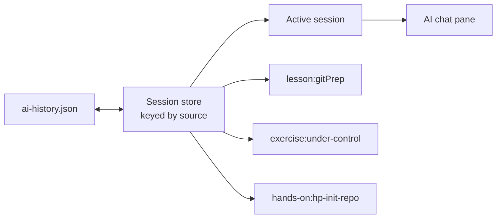
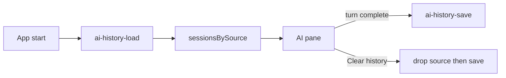

# AI chat persistence

**Status:** Implemented

AI conversations survive source changes and app restarts. One conversation per source is stored in
`ai-history.json` under Electron's `userData` directory. Source identity and switching behavior are
defined in `ai-chat-sources.md`.

## Model

The renderer keeps all loaded sessions in a source-keyed `Record`. The AI pane displays one of them at a
time:



Switching sources selects another stored session; it does not clear either conversation. Returning
to a source restores its messages. Empty sessions (open then close with no messages) are not written.

## File shape

Store a versioned, JSON-serialisable projection of the chat state rather than the AI SDK's full
runtime objects. The file lives next to `config.json`, not inside it.

```ts
type StoredAiHistory = {
  version: 1;
  sessions: Record<string, StoredAiSession>;
};

type StoredAiSession = {
  source: AiSource;
  conversationId: string;
  updatedAt: string;
  messages: StoredAiMessage[];
};

type StoredAiMessage = {
  id: string;
  role: "user" | "assistant";
  text: string;
};
```

Every AI entry point returns an `AiSource` containing a namespaced `sourceKey`, such as
`lesson:gitPrep`. That key is the record key in `sessions`; loading validates that it matches
`session.source.sourceKey`. The source title may be refreshed when the source is opened.

Persisting selected lesson text as distinguishable message metadata is deferred with the lesson-text
selection feature. It can later add an optional `selectedText` field through a schema migration. It
remains part of the user message, never a context block.

## What is not persisted

Persist only the visible transcript. Do not write:

- context blocks, including repository state, file names, or scraped instructions;
- provider credentials, model request objects, or system prompts;
- streaming status, errors, abort controllers, or incomplete assistant messages;
- empty sessions;
- composer drafts, including a ChatGPT link prompt that has not been sent.

The renderer maps `GitMasteryUIMessage` to `StoredAiMessage` by joining text parts only. Exercise and
hands-on context is collected fresh on the next send. This avoids retaining stale repository snapshots
and keeps the history file inside the privacy boundary documented in `ai-context-providers.md`.

## Ownership and writes

The Electron main process owns the file (`src/electron/ai/history.ts`) and exposes `ai-history-load`
and `ai-history-save`. The renderer owns the in-memory session store and sends a serialisable snapshot
to main, which re-validates each source with `parseAiSource` before writing.



On startup the renderer hydrates `sessionsBySource` before the first `ai-hints-open` when possible.
If a source is opened while load is in flight, a live session with messages wins; an empty live
session takes titles from disk and keeps any in-memory composer draft.

Write when a turn finishes (`useChat` status is not `submitted` or `streaming`), not on every stream
chunk. Writes are serialized and atomic: write a temporary file in the same directory, then rename it
over `ai-history.json`.

On startup, main validates `version === 1` and the session shape before returning history. A missing
file means empty history. Invalid or corrupt data is renamed aside
(`ai-history.corrupt-<timestamp>.json`) and replaced with an empty store. A file with a newer
unsupported version is left untouched and ignored rather than overwritten; later saves refuse to
replace it.

## Retention

History is bounded on disk. These limits are independent of the 20-message window sent to the model
on each turn (`MAX_HISTORY_MESSAGES` in `src/electron/ai/chat.ts`).

- Each stored message is clipped at 20,000 characters. The composer uses the same `maxLength`, so a
  paste is cut in the field before Send.
- Each source session is trimmed to 256 KB of JSON (`JSON.stringify(session)`). Oldest complete
  turns are dropped silently until it fits. `conversationId` is unchanged.
- The whole `ai-history.json` payload must stay under 5 MiB. If it would exceed that (or the write
  fails), the previous file is left untouched and the pane shows a warning toast: "Couldn't save
  chat history on this computer." The turn stays on screen; Send is not blocked.

## Clear behavior

**Clear history** deletes that source from memory and disk, then keeps the pane open on a brand-new
empty session for the same source:

1. Stop any in-flight turn.
2. Drop the `sourceKey` from `sessionsBySource`.
3. Save the remaining record to disk.
4. Insert a fresh empty session so the student can keep asking. That empty session is memory-only
   until the next completed turn.

Reopening the same lesson or exercise after a restart therefore starts blank. **Clear all histories**
is deferred; one session per source is already the only store shape.

Removing an exercise folder does not remove its transcript; the source may still be reopened without
workspace context.

The file is plaintext within the operating system's per-user application-data directory. The pane
disclaimer states that chats are saved locally on this computer.
