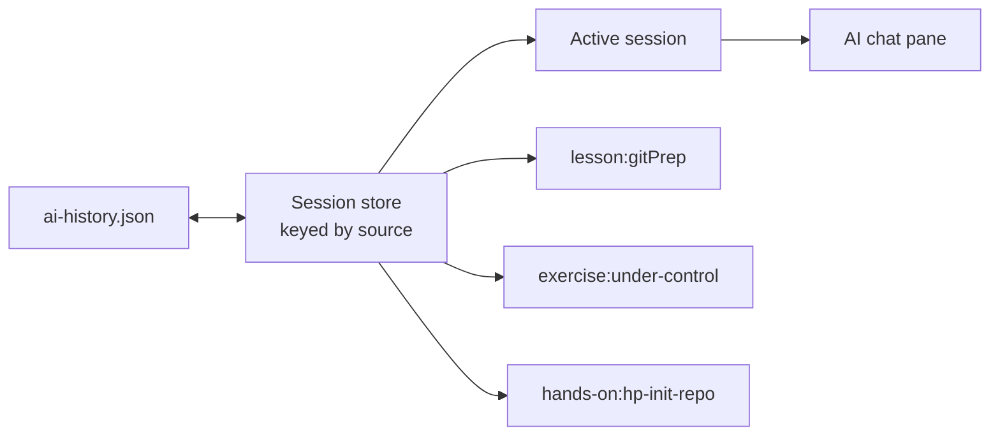

# AI chat persistence

**Status:** Proposed

AI conversations should survive source changes and app restarts. Persist one conversation per source
in `ai-history.json` under Electron's `userData` directory. Source identity and switching behavior
are defined in `ai-chat-sources.md`.

## Model

The renderer keeps all loaded sessions in a source-keyed `Record`. The AI pane displays one of them at a
time:



Switching sources selects another stored session; it does not clear either conversation. Returning
to a source restores its messages. **Clear history** resets only the active source and persists that
change immediately.

## File shape

Store a versioned, JSON-serialisable projection of the chat state rather than the AI SDK's full
runtime objects:

```ts
type StoredAiHistory = {
  version: 1;
  sessions: Record<string, StoredAiSession>;
};

type StoredAiSession = {
  source: AiSource;
  conversationId: string;
  updatedAt: string;
  messages: StoredAiMessage[];
};

type StoredAiMessage = {
  id: string;
  role: "user" | "assistant";
  text: string;
};
```

Every AI entry point returns an `AiSource` containing a namespaced `sourceKey`, such as
`lesson:gitPrep`. That key is the record key in `sessions`; loading validates that it matches
`session.source.sourceKey`. The source title may be refreshed when the source is opened.

Persisting selected lesson text as distinguishable message metadata is deferred with the lesson-text
selection feature. It can later add an optional `selectedText` field through a schema migration. It
remains part of the user message, never a context block.

## What is not persisted

Persist only the visible transcript. Do not write:

- context blocks, including repository state, file names, or scraped instructions;
- provider credentials, model request objects, or system prompts;
- streaming status, errors, abort controllers, or incomplete assistant messages.

Exercise and hands-on context is collected fresh on the next send. This avoids retaining stale
repository snapshots and keeps the history file inside the privacy boundary documented in
`ai-context-providers.md`.

## Ownership and writes

The Electron main process owns the file and exposes narrow load/save IPC operations. The renderer
owns the in-memory session store and sends validated, serialisable history to main.

Write after a user message is accepted and again when its assistant response completes. Do not write
each streaming chunk. Writes are serialized and atomic: write a temporary file in the same
directory, then rename it over `ai-history.json`.

On startup, main validates the version and shape before returning history. A missing file means empty
history. Invalid or corrupt data is preserved under a diagnostic filename and replaced with an empty
store. A file with a newer unsupported version is left untouched and ignored rather than
overwritten.

## Retention

History must be bounded even though context is excluded:

- keep at most 50 source sessions, evicting the least recently updated;
- keep at most 100 messages per source, trimming oldest complete turns first;
- cap each stored message at 20,000 characters;
- reject a history payload larger than 5 MiB.

Trimming affects stored and displayed history. The model's existing, smaller request-history limit
remains independent.

## Clear behavior

- **Clear history:** replace the active source's messages with an empty array and generate a new
  `conversationId`.
- **Clear all histories:** delete `ai-history.json` and clear the in-memory store. This control can be
  added when persisted history ships.
- Removing an exercise folder does not remove its transcript; the source may still be reopened
  without workspace context.

The file is plaintext within the operating system's per-user application-data directory. The UI
should state that chat history is saved locally and provide the clear-all control.
