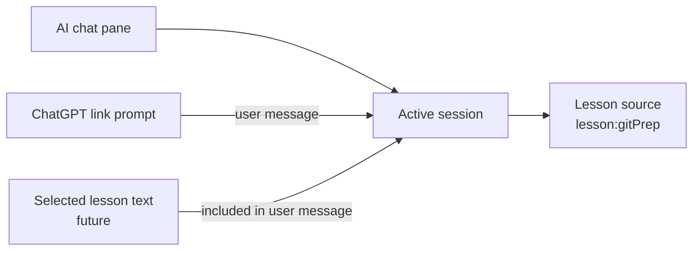
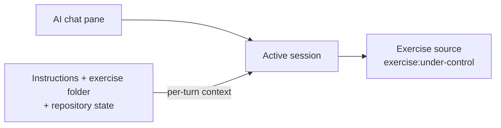

# AI chat sources and sessions

**Status:** Implemented (in-memory). Disk persistence is proposed in `ai-chat-persistence.md`.

The AI Hints pane supports lesson questions as well as exercises and hands-on practicals.
ChatGPT links in a lesson open the existing pane and ask their encoded question there, without
creating a separate popup.

## Model

The pane, session, source, and message are separate concepts:

- The **pane** is the single visible container above the terminal.
- A **session** owns one conversation. The pane displays at most one active session.
- A **source** identifies what the conversation is about.
- A **message** holds what the user asks, including any selected lesson text.
- **Context** is supporting data the app collects, such as exercise instructions and repository
  state.






Use a namespaced source key:

```ts
type AiSource =
  | {
      sourceKey: `lesson:${string}`;
      kind: "lesson";
      id: string;
      title: string;
    }
  | {
      sourceKey: `exercise:${string}`;
      kind: "exercise";
      id: string;
      title: string;
    }
  | {
      sourceKey: `hands-on:${string}`;
      kind: "hands-on";
      id: string;
      title: string;
    };

type AiSession = {
  source: AiSource;
  conversationId: string;
  updatedAt: string;
  messages: GitMasteryUIMessage[];
};

type AiChatState = {
  activeSourceKey: string | null;
  sessionsBySource: Record<string, AiSession>;
};
```

The renderer keeps `sessionsBySource` as a `Record` so a later `ai-history.json` phase can hydrate
the same shape. For a lesson, `id` is the stable lesson URL segment (`gitPrep` in `/lessons/gitPrep/`),
not the question or selected text. Exercise and hands-on ids remain their existing download
identifiers. Every entry point returns the source's namespaced `sourceKey`.

## Session behavior

- The first AI entry point for a source creates its session and opens the pane.
- Another ChatGPT link in the same lesson reuses that lesson session and adds its prompt as a new
  user message.
- Opening AI help for a different source selects or creates that source's session without clearing
  any other session.
- Returning to a source restores its conversation from the in-memory source-keyed store.
- Closing the pane hides it without clearing the active session.
- **Clear history** creates a new `conversationId` while retaining the same source.

## ChatGPT link interception

The published lessons currently contain 19 links with one consistent shape:
`https://chatgpt.com/?q=<encoded prompt>`, all opened with `target="_blank"`.

The `WebContentsView` popup handler:

1. Matches the exact `https:` protocol, `chatgpt.com` hostname, `/` path, and a non-empty `q`.
2. Reads the current lesson id from the embedded page URL, and the title from the page.
3. Denies the popup when AI is configured and the page is a lesson.
4. Opens or reuses that lesson's session and submits the decoded `q` value once (keyed by a prompt
   id, so a later title refresh does not send it again).

Other popup URLs keep their existing behavior. If no AI provider is configured, or the page is not a
lesson, the original ChatGPT popup remains available.

## Future lesson selections

Selected text should be included in one user message, not stored as context or used as a new source
or session. For example:

```ts
type LessonMessage = {
  question: string;
  selectedText?: string;
};
```

The user can select lesson text and ask a question in the existing lesson session. The selected text
is visible as part of their message. The session remains keyed to the lesson, so changing the
selection does not fragment the conversation or require new identity rules.

## Prompt policy

Prompt policy follows the source kind:

- **Lesson:** explain Git, GitHub, terminal, and Git-Mastery concepts; no exercise workspace is
  collected or required.
- **Exercise:** retain the graded-exercise hint policy and repository context.
- **Hands-on:** retain the guided-practical policy and repository context.

This keeps lesson help independent of exercise download state while preserving the stronger
pedagogical rules where they matter.
