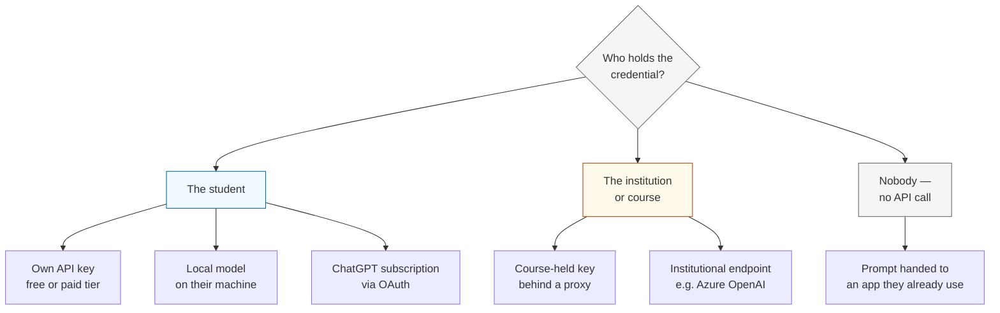

# LLM access options

Git-Mastery Desktop needs a way to reach a language model so it can help students who get stuck.
This document assesses **how the app obtains inference** — nothing else. Features, prompting,
what context is gathered, and how answers are shaped are separate concerns and are not covered here.

The target audience is NUS students. They have a university ChatGPT plan through SSO, they generally
do not have paid API accounts, and they are able to sign up for a free API key if told how. The app
runs locally on their own machine, which means any credential involved is a credential the student
holds or the app ships with.

This is an assessment, not a recommendation. Each option is described on the same four axes so they
can be compared directly.

| Axis            | Question                                                          |
| --------------- | ----------------------------------------------------------------- |
| **Capability**  | Which models are reachable, at what context length and quality    |
| **Cost**        | What the student pays, and what the project or department pays    |
| **Setup**       | What a student must do once, before the feature works             |
| **Feasibility** | Whether it can be built, and whether it is likely to keep working |

---

## The shape of the problem

Every option is a different answer to one question: _whose credential pays for the call?_



Options that put the credential on the student cost the project nothing but require setup from every
individual. Options that put it on the institution invert that. Options that avoid the API entirely
cost nothing and require nothing, but give the app no control over the answer.

---

## How these were checked

Endpoints were probed directly on 29 August 2026. An unauthenticated request that returns `401`,
`403`, or `400 invalid key` confirms the route exists and is rejecting a missing credential — the
healthy result. A `404` means the path is wrong. A `410` or a DNS failure means the service is gone.

Rate limits and prices come from vendor documentation and secondary reporting; they move often and
are marked where sources disagree. Anything not directly probed is labelled as such.

---

## Option 1 — Student-supplied API key

The student obtains their own key from a provider and enters it in the app. The app talks to any
provider exposing an OpenAI-compatible `POST {baseUrl}/chat/completions` endpoint, which is now the
de facto standard across the industry.

**Capability.** Wide. The same client reaches free-tier models, frontier paid models, and anything
self-hosted. Free tiers in this class currently reach context windows from 64k to over 1M tokens.
Quality is whatever the student's chosen provider offers, which varies considerably.

**Cost.** Zero for the project. Zero for the student if they pick a free tier; their own spend if
they use a paid key they already have.

**Setup.** Sign up with a provider, generate a key, paste it into the app once. Roughly two to five
minutes with instructions. This is a per-student, one-time cost that scales linearly with cohort size
and is where support burden concentrates.

**Feasibility.** High, and durable. No single vendor is load-bearing: if one free tier closes or
degrades, the student switches provider in settings and the app is unchanged. This durability is not
theoretical — see Option 9.

### Providers verified for this option

All probed 29 Aug 2026. "Free tier" means a usable key obtainable without a credit card.

| Provider      | `baseUrl`                                                 | Probe                                   | Free tier                    |
| ------------- | --------------------------------------------------------- | --------------------------------------- | ---------------------------- |
| OpenRouter    | `https://openrouter.ai/api/v1`                            | `/models` → `200`                       | **21 models priced at zero** |
| Google Gemini | `https://generativelanguage.googleapis.com/v1beta/openai` | `/chat/completions` → `400 invalid key` | Yes, no card                 |
| Groq          | `https://api.groq.com/openai/v1`                          | `401`                                   | Yes, no card                 |
| Cerebras      | `https://api.cerebras.ai/v1`                              | `403`                                   | Yes, no card                 |
| Mistral       | `https://api.mistral.ai/v1`                               | `401`                                   | Yes, phone verification      |
| DeepSeek      | `https://api.deepseek.com/v1`                             | `401`                                   | No                           |
| Together      | `https://api.together.xyz/v1`                             | `401`                                   | No                           |
| OpenAI        | `https://api.openai.com/v1`                               | `401`                                   | No                           |
| Anthropic     | `https://api.anthropic.com/v1`                            | `/chat/completions` → `401`             | No                           |

Two details worth recording, both confirmed by probe rather than documentation:

- **Gemini's compatibility layer has no `/models` route.** `/v1beta/openai/chat/completions` is live,
  but `/v1beta/openai/models` returns `404 Requested entity was not found`. Model discovery cannot be
  assumed to work uniformly across providers.
- **Anthropic exposes an OpenAI-compatible endpoint.** `POST https://api.anthropic.com/v1/chat/completions`
  returns `401 Invalid Anthropic API Key` rather than a `404`, so a Claude key needs no special path.

### Free-tier capacity

| Provider   | Reported free allowance                                  | Confidence                    |
| ---------- | -------------------------------------------------------- | ----------------------------- |
| OpenRouter | 21 models at `pricing.prompt == 0`; contexts 64k–1M      | **Probed directly**           |
| Cerebras   | ~1M tokens/day                                           | Vendor reporting              |
| Mistral    | ~1B tokens/month, open-weight models                     | Vendor reporting              |
| Groq       | ~30 req/min, ~14,400 req/day                             | Vendor reporting              |
| Gemini     | ~10–15 req/min; daily cap reported between 250 and 1,500 | **Sources disagree — verify** |

The OpenRouter zero-cost list at time of probe included `thinkingmachines/inkling` and
`minimax/minimax-m3` at 1M context, `nvidia/nemotron-3.5-lightning` at 1M, and
`google/gemma-4-31b-it` at 262k. Membership of that list changes without notice, which is an argument
for reading it at runtime rather than hard-coding it.

---

## Option 2 — Local model on the student's machine

The student installs Ollama or similar; the app points at `http://localhost:11434/v1`, which is
OpenAI-compatible.

**Capability.** Limited by the student's hardware. Models in the 3B–8B range run acceptably on a
typical laptop; these are noticeably weaker at instruction-following, and in particular at
_withholding_ information on request, which matters for a teaching tool. No network dependency.

**Cost.** Zero, permanently. No rate limits, no quotas, no vendor relationship.

**Setup.** Heaviest of any option: install a runtime, download a multi-gigabyte model, and have
enough RAM and disk. Realistically only a subset of a cohort will complete this.

**Feasibility.** Straightforward to support — it is the same client as Option 1 with a different base
URL. Detecting whether `ollama` is on `PATH` follows the pattern already used for `git` and `gh`.
Viable as an additional choice; unlikely to serve a whole cohort.

---

## Option 3 — Course-held key behind a proxy

The teaching team holds one API key behind a small gateway. The app calls the gateway; the gateway
holds the credential and applies per-student quotas.

**Capability.** Full choice of model, decided centrally. Consistent for every student, so the
experience can be tuned and reasoned about.

**Cost.** Real, but small. Illustrative, using ~4,000 tokens in and ~300 out per request, and a
500-student cohort making 30 requests each per semester — 60M input and 4.5M output tokens:

| Model tier                           | Approximate semester cost |
| ------------------------------------ | ------------------------- |
| `gpt-5-nano` at $0.05 / $0.40 per 1M | ≈ $4.80                   |
| GPT-5.6 Luna at $0.20 / $1.20 per 1M | ≈ $17.40                  |

Prices are as reported following OpenAI's 30 July 2026 reduction and should be re-checked against the
current rate card. The order of magnitude — tens of dollars per cohort per semester, not thousands —
is the durable part.

**Setup.** None for the student. The app works on first launch.

**Feasibility.** Technically simple; the gateway is a thin OpenAI-compatible passthrough. The real
requirements are organisational: a budget line, someone who owns the key and the server, and an abuse
story. It also concentrates risk — if the gateway is down, every student is affected simultaneously.

---

## Option 4 — Institutional endpoint

If NUS already operates an Azure OpenAI deployment or a similar internal endpoint, the app points at
it.

**Capability.** Whatever the institution provisions. Typically frontier models with enterprise data
handling, which is materially better for privacy than sending student repository state to a consumer
free tier.

**Cost.** Absorbed by existing institutional spend, or billed to the department.

**Setup.** Depends on the endpoint's auth model. If it accepts SSO, none; if it issues keys, similar
to Option 1.

**Feasibility.** Unknown until asked — this is an open question rather than an assessment. If such an
endpoint exists it is likely OpenAI-compatible, in which case it costs nothing extra to support. Note
that a ChatGPT Enterprise agreement does not imply one exists; see Option 5.

---

## Option 5 — ChatGPT Enterprise seat used as an API

Students have NUS ChatGPT access through SSO. The question is whether that seat can serve the app.

**Capability.** Not applicable — the seat provides no programmatic interface to a third-party
application.

**Cost.** Not applicable.

**Setup.** Not applicable.

**Feasibility.** Not possible as stated. ChatGPT Enterprise workspace membership and OpenAI API
Platform organisation membership are administered separately; OpenAI's documentation states that
belonging to one does not grant the other. A seat is a licence to use ChatGPT's own interface, not a
credential the app can present. Driving the web session inside an embedded browser view would be
fragile and outside the terms of service.

The relevant follow-up is not "can we use the seat" but "does the institution also hold an API
Platform organisation" — which is Option 4.

---

## Option 6 — Sign in with ChatGPT (Codex OAuth)

OpenAI operates an OAuth flow that bills model usage to a user's ChatGPT subscription, Enterprise
included. This is the one OpenAI credential that draws on a subscription rather than a separate API
balance.

**Capability.** Frontier OpenAI models, subject to the plan's own limits.

**Cost.** No new spend for the student, but usage is metered. ChatGPT Enterprise separates standard
ChatGPT seats from **Codex seats**, and Codex usage bills as credits per million tokens. Students
would need Codex entitlement, and the traffic would draw down institutional credits.

**Setup.** A browser-based sign-in, comparable to any OAuth flow.

**Feasibility.** Technically demonstrated — third-party tools do use this flow — but it is documented
only for OpenAI's own clients (ChatGPT desktop, Codex CLI, IDE extension). There is no published
`client_id` or registration path for external applications, so an integration would rely on
undocumented behaviour.

Two constraints bear on how durable that is. Anthropic prohibited subscription OAuth in third-party
tools in February 2026 and began enforcing it in April 2026; Google made an equivalent change for
Gemini CLI. OpenAI has moved the other way, broadening Codex access across paid plans during the same
period. The pattern is therefore permitted by one major vendor and closed by two others, and that
position has changed within the last twelve months.

Additionally, device-code and workspace login behaviour is subject to admin settings, so this route
depends on NUS configuration regardless of what OpenAI permits.

---

## Option 7 — MCP server plus the student's own assistant

Rather than calling a model, the app exposes its local context over the Model Context Protocol, and
the student connects an assistant they already use.

**Capability.** Whatever the student's assistant provides — potentially frontier models at no cost to
anyone. The app supplies local repository context that a browser-based chat otherwise cannot see.

**Cost.** Zero to the project and zero additional cost to the student.

**Setup.** A one-time client configuration, and support varies sharply by client:

| Client            | Local MCP server | Notes                                                                                 |
| ----------------- | ---------------- | ------------------------------------------------------------------------------------- |
| Claude Desktop    | Supported        | Local process, no network exposure                                                    |
| VS Code / Copilot | Supported        | Copilot Pro is free for students via the GitHub Student Pack                          |
| ChatGPT           | **Not directly** | Connectors require a public HTTPS URL; `localhost` and private addresses are rejected |

**Feasibility.** Buildable, with one significant limitation: the assistant the cohort actually has —
ChatGPT — cannot reach a server on the student's own machine without a tunnel, which is more setup
than pasting an API key. This option serves Claude and Copilot users well and ChatGPT users poorly.

A second consequence is loss of control: once the conversation happens inside someone else's client,
the app cannot inspect or constrain the response. Any teaching constraints must be expressed as
instructions inside the tool payload and cannot be enforced.

---

## Option 8 — Hand the prompt to an app the student already has

The app assembles a prompt, copies it to the clipboard, and opens ChatGPT in the system browser. The
student pastes it.

**Capability.** Full frontier-model quality via the student's existing plan. The app keeps control of
what goes into the prompt, but none over what comes back.

**Cost.** Zero to everyone.

**Setup.** None whatsoever. Works for every student on first launch, including anyone who declines
to configure a key.

**Feasibility.** Trivial to build — clipboard plus `shell.openExternal`, both already available. It
is the only option with no credential, no vendor relationship, and no dependency that can be
withdrawn. The trade is experience: no streaming into the app, no follow-up questions in context, and
a manual paste step every time.

---

## Option 9 — GitHub Models

Recorded because it was assessed and because its outcome informs how the other options should be
weighted.

GitHub operated a free, rate-limited, OpenAI-compatible inference endpoint that accepted a GitHub
token. Since the app already requires the GitHub CLI during setup, every student would have finished
onboarding holding a usable credential with no additional steps.

**Feasibility.** None — the service no longer exists. Probed with a live token:

```
POST https://models.github.ai/inference/chat/completions   → HTTP 410
{"error":{"code":"github_models_retirement_brownout"}}

https://models.inference.ai.azure.com                      → DNS resolution failure
```

GitHub Models closed to new customers on 16 June 2026 and was fully retired on 30 July 2026 —
playground, model catalog, inference API and BYOK — with no grandfathering for existing users.

The general point: a free tier can be announced, deprecated, and removed within a single semester.
Any option in this document that depends on one vendor's goodwill carries that risk, and the ones
that route through a swappable base URL carry it least.

---

## Option 10 — Ship a key inside the application

Recorded for completeness so the option is explicitly closed.

A key embedded in an Electron build is extractable from the application bundle by anyone who
downloads it. Usage would be unbounded and billed to whoever owns the key. This is not a viable
option at any scale.

---

## Comparison

| Option                     | Capability                     | Cost to student | Cost to project | Setup                 | In-app answer | Feasibility          |
| -------------------------- | ------------------------------ | --------------- | --------------- | --------------------- | ------------- | -------------------- |
| 1. Student API key         | Wide; free tiers to 1M context | $0 on free tier | $0              | Paste one key         | Yes           | High, durable        |
| 2. Local model             | Weak; hardware-bound           | $0              | $0              | Install + GB download | Yes           | High, low uptake     |
| 3. Course proxy            | Full, uniform                  | $0              | ~$5–20/semester | None                  | Yes           | Needs owner + budget |
| 4. Institutional endpoint  | Enterprise-grade               | $0              | Institutional   | Varies                | Yes           | Unknown — must ask   |
| 5. ChatGPT Enterprise seat | —                              | —               | —               | —                     | —             | Not possible         |
| 6. Codex OAuth             | Frontier OpenAI                | $0 direct       | NUS credits     | Browser sign-in       | Yes           | Undocumented         |
| 7. MCP + own assistant     | Frontier                       | $0              | $0              | Client config         | No            | Not for ChatGPT      |
| 8. Prompt handoff          | Frontier                       | $0              | $0              | None                  | No            | Trivial              |
| 9. GitHub Models           | —                              | —               | —               | —                     | —             | Retired              |
| 10. Bundled key            | Full                           | $0              | Unbounded       | None                  | Yes           | Not viable           |

Note that Options 1, 2, 3 and 4 are the same client with a different base URL. Supporting any one of
them makes the others a configuration change rather than new work. Options 7 and 8 are structurally
different: they hand the question to another application and give up control of the response.

---

## What the app sends to the model

This was previously an open question. It is now a stated policy, so that the compliance
conversation has a concrete artifact to point at rather than a question.

**Sent, when the student asks for a hint:**

- the exercise brief, as rendered on the lesson page;
- the student's course position and the lessons still ahead of them;
- the current branch, the recent commit subjects, branch names, remote names, and the **names and
  staged/unstaged status** of files inside the exercise folder.

**Never sent:**

- the contents of any file;
- anything outside the exercise folder;
- terminal scrollback;
- any credential.

Two properties make that boundary real rather than aspirational:

1. **Containment is enforced, not promised.** Git searches upwards for a repository, so in an
   exercise that has no repository yet — `under-control`, where running `git init` _is_ the task —
   a naive `git status` succeeds against whatever repository happens to sit above the exercises
   folder. A student whose home or coursework directory is a Git repository would leak unrelated
   branch names and filenames. The app therefore resolves the repository root first and refuses to
   read anything unless that root **is** the exercise's own directory, with
   `GIT_CEILING_DIRECTORIES` as a second line of defence.
2. **Disclosure is by construction.** Every block sent is rendered in the chat panel's expandable
   "Context attached" chip, so a student can read exactly what left their machine, per answer. The
   same summary is shown at the point the API key is entered.

Adding `git diff`, file contents, or terminal output would cross this boundary and needs to be
treated as a new decision, not an extension of this one.

---

## Open questions

These would change the assessment and cannot be resolved from inside the codebase.

1. **Does NUS hold an OpenAI API Platform organisation, or an Azure OpenAI deployment?** A yes makes
   Option 4 concrete and changes the cost picture for Option 3.
2. **Would the department fund and own a proxy?** Option 3's technical cost is low; its
   organisational cost is the whole question.
3. **How much per-student setup is acceptable?** This is the axis on which Options 1, 3 and 8 differ
   most, and it is a judgement about the cohort rather than about the technology.
4. **What are Gemini's current free-tier daily limits?** Reported figures range from 250 to 1,500
   requests per day; the difference matters if Gemini is presented as a default.

---

_Endpoint probes conducted 29 August 2026. Pricing and rate limits are vendor-reported and change
frequently — re-verify before relying on any figure here._
